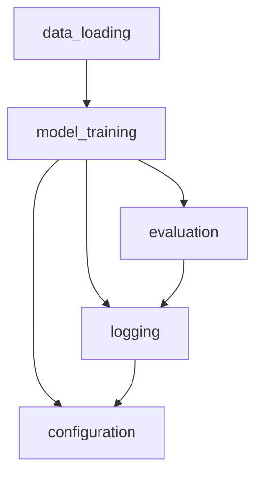

# Product Requirements Document: Clean-Room Finetune TabPFN

---

## Introduction
This document describes the requirements, goals, and design for a clean-room reimplementation of the finetune_tabpfn_v2 project. The aim is to provide a robust, modular, and extensible Python package for finetuning TabPFN models on tabular datasets, suitable for both research and production use, and easily integrable with AutoML pipelines.

---

## Product Name
Clean-Room Finetune TabPFN

---

## Target Users
- Data scientists and ML engineers seeking to finetune TabPFN models on custom tabular datasets.
- Researchers interested in experimenting with tabular model finetuning and benchmarking.
- Developers integrating advanced tabular model finetuning into AutoML systems.

---

## Features and Requirements

### 1. Finetuning TabPFN
- Enable finetuning of TabPFN models on a single tabular dataset.
- Support for loading a base TabPFN model and saving the finetuned model checkpoint.

### 2. Minimal Hyperparameter Interface
- Expose only essential hyperparameters: learning rate, batch size.
- Provide sensible defaults and allow user override.

### 3. Adaptive Early Stopping
- Implement early stopping based on validation loss improvement.
- Support time-based early stopping (user-defined time limit).
- Allow configuration of patience and minimum delta for validation loss.

### 4. Logging
- Support both offline (local file/plot) and online (wandb) logging of training metrics and curves.
- Log training/validation loss, accuracy, and other relevant metrics.
- Optionally support custom logging backends via plugin interface.

### 5. Task Flexibility
- Support binary classification, multiclass classification, and regression tasks.
- Automatically infer task type from data or allow user specification.

### 6. Mixed Precision, Gradient Scaling, and Clipping
- Enable mixed precision training for performance (if supported by hardware).
- Implement gradient scaling and clipping to stabilize training.
- Allow configuration of gradient accumulation steps.

### 7. Extensibility for AutoML
- Provide a clean API for integration with AutoML pipelines.
- Allow programmatic configuration and execution.
- Design for easy extension to new tasks, logging backends, or model types.

### 8. Robust Error Handling
- Validate user inputs and configuration.
- Provide clear error messages and logging for debugging.

### 9. Documentation and Examples
- Include example scripts and notebooks for common workflows.
- Document all configuration options and expected data formats.

### 0. Synthetic Data Generation for Fine-Tuning
- Generate or simulate tabular data suitable for use in the finetuning pipeline.
- Specify data schema, feature distributions, and ensure compatibility with the PRD workflow.
- Document the process and provide scripts or notebooks for reproducibility.

---

## Acceptance Criteria
- The package must allow users to finetune a TabPFN model on a single tabular dataset with minimal configuration.
- Only learning rate and batch size are required as hyperparameters; all others have sensible defaults.
- Early stopping (validation-based and time-based) is configurable and works as described.
- Logging is available both offline and via wandb, with clear training curves and metrics.
- The system supports binary, multiclass, and regression tasks, with correct task inference or user override.
- Mixed precision, gradient scaling, and accumulation are available and configurable.
- The API is clean, Pythonic, and documented with examples.
- The codebase is modular, with clear interfaces for extension and integration.
- User and developer documentation is complete and up to date.
- The package passes all provided example scripts and notebooks without errors.

---

## Timeline and Delivery
- **Week 1:** Project setup, initial architecture, and scaffolding.
- **Week 2:** Implement core finetuning logic and minimal hyperparameter interface.
- **Week 3:** Add early stopping, logging, and task flexibility features.
- **Week 4:** Integrate mixed precision, gradient scaling, and extensibility hooks.
- **Week 5:** Write documentation, examples, and developer guides.
- **Week 6:** Testing, bug fixing, and final review.
- **Week 7:** Release v1.0.0 and collect user feedback.

---

## System Architecture and Module Design

### High-Level Architecture
The project will be organized as a modular Python package with the following main modules:

- **data_loading**: Handles reading, validating, and preprocessing tabular data.
- **model_training**: Manages the finetuning process, including training loop, early stopping, and checkpointing.
- **evaluation**: Provides utilities for model evaluation and metric calculation.
- **logging**: Abstracts logging functionality, supporting both offline and online (wandb) backends.
- **configuration**: Manages user and programmatic configuration, including hyperparameters and runtime options.
- **utils**: Shared utilities (e.g., error handling, data validation).

### Module Diagram (Mermaid)


### Main Interfaces
- **DataLoader**: Loads and preprocesses data, returns train/val/test splits.
- **Trainer**: Orchestrates training, early stopping, and checkpointing.
- **Evaluator**: Computes metrics on validation/test data.
- **Logger**: Unified interface for logging metrics and training curves.
- **Config**: Loads and validates configuration from file or arguments.

### Extensibility
- Each module exposes clear interfaces for extension (e.g., new logging backends, custom data loaders).
- Designed for maintainability and future feature additions.

---

## API and Example Usage

### User-Facing API

#### Main Functions/Classes
- `fine_tune_tabpfn(path_to_base_model, save_path_to_fine_tuned_model, time_limit, finetuning_config, validation_metric, X_train, y_train, categorical_features_index, device, task_type, show_training_curve, logger_level, use_wandb)`
  - Finetunes a TabPFN model on the provided dataset.
  - Parameters:
    - `path_to_base_model`: str, path or identifier for the base model
    - `save_path_to_fine_tuned_model`: str, where to save the finetuned model
    - `time_limit`: int, max seconds for training
    - `finetuning_config`: dict, e.g., `{"learning_rate": 0.00001, "batch_size": 20}`
    - `validation_metric`: str, e.g., "log_loss"
    - `X_train`, `y_train`: training data
    - `categorical_features_index`: list or None
    - `device`: "cpu" or "cuda"
    - `task_type`: "binary", "multiclass", or "regression"
    - `show_training_curve`: bool
    - `logger_level`: int
    - `use_wandb`: bool
  - Returns: Path to saved model checkpoint

#### Example Usage
```python
from mypackage.finetune import fine_tune_tabpfn

# Prepare data (e.g., using sklearn)
X_train, y_train = ...

# Finetune
model_path = fine_tune_tabpfn(
    path_to_base_model="auto",
    save_path_to_fine_tuned_model="./fine_tuned_model.ckpt",
    time_limit=60,
    finetuning_config={"learning_rate": 0.00001, "batch_size": 20},
    validation_metric="log_loss",
    X_train=X_train,
    y_train=y_train,
    categorical_features_index=None,
    device="cuda",
    task_type="multiclass",
    show_training_curve=True,
    logger_level=0,
    use_wandb=False,
)
```

#### Configuration File Example (YAML)
```yaml
base_model: auto
save_path: ./fine_tuned_model.ckpt
time_limit: 60
finetuning:
  learning_rate: 0.00001
  batch_size: 20
validation_metric: log_loss
device: cuda
task_type: multiclass
show_training_curve: true
logger_level: 0
use_wandb: false
```

### Additional API
- `TabPFNClassifier(model_path).fit(X, y)` for evaluation and prediction after finetuning.

---

## Documentation and Extensibility Requirements

### User Documentation
- Getting started guide (installation, setup, quickstart)
- Detailed usage instructions for finetuning, evaluation, and logging
- Configuration reference (all options, formats)
- Example scripts and notebooks for common workflows
- FAQ and troubleshooting section

### Developer Documentation
- Codebase overview and module descriptions
- API reference with docstrings for all public functions/classes
- Guidelines for contributing (code style, testing, pull requests)
- Extending the codebase (adding new logging backends, tasks, etc.)

### Code Comments and Standards
- All public functions/classes must have docstrings (PEP257 compliant)
- Inline comments for complex logic or non-obvious decisions
- Consistent naming conventions (PEP8)

### Extensibility
- Clear interfaces for adding new logging backends, data loaders, or model types
- Modular design to facilitate future research and integration
- Guidelines for submitting extensions or plugins 